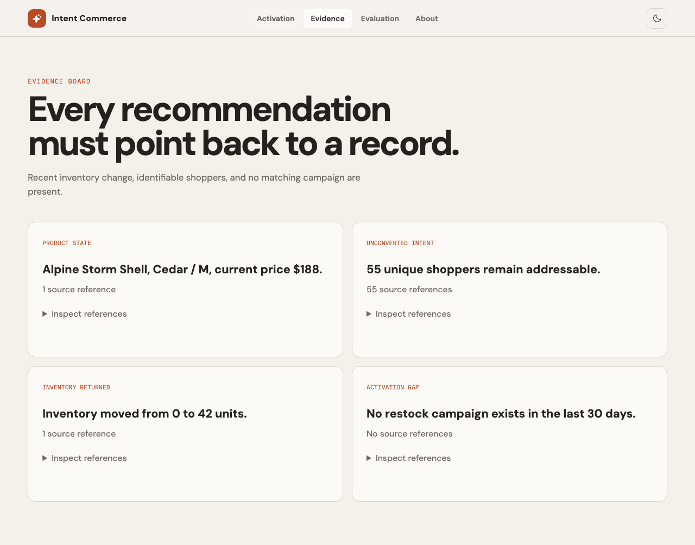

# Intent Commerce Activation Workbench

A working product prototype that turns synthetic shopper-intent signals into evidence-backed merchant activation decisions.



## What it proves

- product judgment around merchant activation
- deterministic data and workflow logic
- CLI-agent orchestration without API keys
- structured evidence and review boundaries
- treatment-versus-holdout outcome attribution
- evaluation of failure and restraint

## Live demo

Publish the `dist/` build through GitHub Pages after creating the standalone repository. The app is configured with a relative Vite base path.

## Five-minute setup

Requirements:

- Node.js 20 or later
- npm
- Codex CLI or Claude Code only if generating a fresh agent run

```bash
npm install
npm run dev
```

The browser demo does not require a model, API key, login, or network request.

## Workflow

```text
Synthetic commerce records
        |
        v
Schema and reference validation
        |
        v
Deterministic opportunity engine
        |
        v
Versioned agent work packet
        |
        v
Codex CLI / Claude Code / manual agent
        |
        v
JSON Schema and evidence validation
        |
        v
Human approve / edit / reject
        |
        v
Treatment-versus-holdout attribution
```

## Generate realistic synthetic data

```bash
npm run data:generate
```

This creates a deterministic dataset with three merchants, 36 products, 3,600 intent events, and 720 orders under `data/`. The committed browser scenario is intentionally smaller so every record can be inspected.

## Run the model layer with a CLI subscription

Prepare a work packet without launching an agent:

```bash
npm run agent:prepare -- --scenario restock-recovery
```

Run with an authenticated Codex CLI subscription:

```bash
npm run agent:run -- --agent codex --scenario restock-recovery
```

Run with an authenticated Claude Code subscription:

```bash
npm run agent:run -- --agent claude --scenario restock-recovery
```

Validate an existing run:

```bash
npm run agent:validate -- --run .runs/<run-directory>
```

The runner:

- gives the agent read-only or plan permissions
- constrains output with a versioned schema
- checks run ID, input hash, opportunity ID, and evidence references
- preserves malformed runs for inspection
- never uses permission-bypass flags

## What is real

- TypeScript opportunity detection
- addressable-audience calculations
- evidence IDs and validation
- scenario-value calculations
- holdout attribution
- review state transitions
- CLI execution and output validation
- unit and browser tests

## What is simulated

- merchant, shopper, product, campaign, and order data
- consent and deliverability checks
- campaign delivery
- production persistence
- observed revenue outcomes

## Documentation

- [Product brief](./PRODUCT_BRIEF.md)
- [Evaluation report](./EVALUATION.md)
- [Decision log](./DECISIONS.md)
- [Agent contract](./agent/commerce-analyst.md)
- [Output schema](./schemas/agent-output.schema.json)
- [Verified Codex CLI run](./examples/verified-codex-run.json)

## Tests

```bash
npm test
npm run build
npm run test:e2e
```

## Production path

A production implementation would add authenticated merchant connections, consent and suppression checks, durable storage, campaign-provider writes, inventory locks, operational monitoring, and merchant-specific evaluation thresholds.

## Independence

This is an independent portfolio project using synthetic data. It is not affiliated with Swym, Shopify, or any merchant platform.
